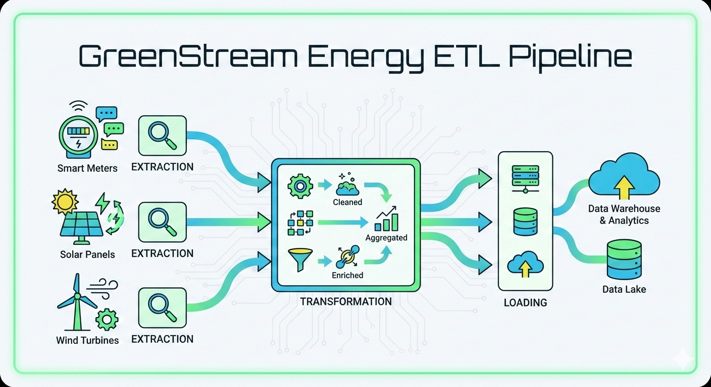

# GreenStream Energy ETL Architecture

<p align="center">
  
</p>


## Serverless Data Transformation Pipeline
---

## 🏗️ Architecture Overview


<p align="center">
  
</p>


```
┌─────────────────────────────────────────────────────────────────────────────┐
│                          EXTERNAL DATA SOURCE                                │
│                     Smart Meters → SFTP/API Gateway                          │
└──────────────────────────────────┬──────────────────────────────────────────┘
                                   │
                                   ▼
┌─────────────────────────────────────────────────────────────────────────────┐
│                         📦 RAW STORAGE LAYER                                 │
│                                                                              │
│                   Object Storage (S3/GCS/Azure Blob)                         │
│                      Timestamped Partitions                                  │
│                   raw/YYYY/MM/DD/HH/meter_data.csv                           │
│                                                                              │
└──────────────────────────┬──────────────────────────┬────────────────────────┘
                           │                          │
                    ✓ Success                    ✗ Failure
                           │                          │
                           ▼                          ▼
            ┌──────────────────────────┐    ┌──────────────────────────┐
            │  🔄 ORCHESTRATION        │    │  ☠️ DEAD LETTER QUEUE    │
            │                          │    │                          │
            │  Serverless Workflow     │    │  Failed Ingestion        │
            │  (Step Functions/        │    │  Manual Review Required  │
            │   Cloud Composer)        │    │  Alert → Data Team       │
            │                          │    │                          │
            │  • Schema Validation     │    └──────────────────────────┘
            │  • Trigger Rules         │
            │  • Job Scheduling        │
            └──────────┬───────────────┘
                       │
                       ▼
            ┌──────────────────────────┐
            │  ⚙️ TRANSFORMATION       │
            │     PROCESSING           │
            │                          │
            │  Serverless Functions    │
            │  (Lambda/Cloud Run)      │
            │                          │
            │  • Unit Standardization  │
            │  • Missing Value Logic   │
            │  • Quality Scoring       │
            │  • Fault Detection       │
            │  • Peak Identification   │
            │                          │
            └──────┬──────────┬────────┘
                   │          │
            ✓ Valid│          │✗ Failed Transform
                   │          │
                   ▼          ▼
       ┌──────────────┐   ┌──────────────────┐
       │              │   │  ⚠️ ERROR QUEUE  │
       │              │   │  & ALERTS        │
       │              │   │                  │
       │              │   │  Auto-Retry (3x) │
       │              │   │  SNS/Email Alert │
       │              │   └──────────────────┘
       ▼              │
┌──────────────┐     │
│ ✅ VALIDATED │     │
│    DATA      │     │
│              │     │
│  PostgreSQL  │     │
│  /MySQL RDS  │     │
│              │     │
│  Real-time   │     │
│  Dashboard   │     │
│  Access      │     │
└──────┬───────┘     │
       │             │
       │             ▼
       │      ┌──────────────────┐
       │      │ ⏸️ QUARANTINE    │
       │      │    STORAGE       │
       │      │                  │
       │      │  Partial Records │
       │      │  Review Required │
       │      │  Quality < 70    │
       │      └──────────────────┘
       │
       ▼
┌─────────────────────────────────────────────┐
│       📊 ANALYTICS STORAGE LAYER            │
│                                             │
│       Columnar Format (Parquet/ORC)         │
│       Partitioned by Date & Meter Type      │
│                                             │
│       • Historical Analysis                 │
│       • ML Model Training                   │
│       • BI Tool Integration                 │
│       • 70% Storage Cost Reduction          │
│                                             │
└─────────────────────────────────────────────┘
```

---

## 📋 Legend

| Symbol | Meaning |
|--------|---------|
| `──►` | **Success Path** (Normal Flow) |
| `- - ►` | **Error Path** (Exception Handling) |
| `📦` | Storage Layer |
| `🔄` | Orchestration/Workflow |
| `⚙️` | Processing/Compute |
| `✅` | Validated Data |
| `⚠️` | Error Handling |
| `☠️` | Dead Letter Queue |
| `⏸️` | Quarantine Zone |
| `📊` | Analytics Ready |

---

## 🎯 Business Transformation Rules

### 1️⃣ Unit Standardization ⚡

```yaml
Rule: Convert all power readings to kilowatts (kW)

Logic:
  - IF unit = "W" or "watts"
    THEN value_kw = value / 1000
  
  - IF unit = "kWh" 
    THEN treat as kW for hourly readings
  
  - IF unit is MISSING
    THEN infer:
      • value < 10 → assume kW
      • value > 1000 → assume W, convert to kW

Quality Impact: -5 points for unit conversion applied
```

### 2️⃣ Missing Value Handling 🔍

```yaml
Gap Detection: Identify time series gaps in meter readings

Logic:
  - Gap < 4 hours
    ACTION: Linear interpolation
    FLAG: None
    QUALITY: -10 points per hour interpolated
  
  - Gap 4h - 24h
    ACTION: Mark as missing_short
    FLAG: ⚠️ Warning
    QUALITY: Exclude from peak analysis
  
  - Gap ≥ 24 hours
    ACTION: Mark as missing_extended
    FLAG: 🚨 Critical Alert
    QUALITY: Trigger engineering notification

Alert Threshold: Extended gaps trigger auto-alerts to Data Ops team
```

### 3️⃣ Data Validation ✓

```yaml
Validation Checks: Multi-layer quality gates

Checks:
  1. Meter Registry Verification
     - Cross-reference meter_id against master registry
     - Reject unknown meter IDs
  
  2. Timestamp Sanity
     - Must be within ±1 hour of server time
     - Detect future timestamps
     - Flag backdated entries
  
  3. Physical Limits
     - Minimum: 0 kW (negative = reject)
     - Maximum: 20 kW (residential limit)
     - Out-of-range → quarantine
  
  4. Rate-of-Change Detection
     - Spike Detection: >500% increase
     - Drop Detection: >90% decrease
     - Flag for manual review

Quality Impact: -15 points per validation warning
```

### 4️⃣ Faulty Meter Detection ⚠️

```yaml
Anomaly Patterns: Automated sensor fault identification

Patterns:
  1. Zero Value Fault
     - Condition: 0 kW for ≥48 consecutive hours
     - Exclusion: Vacant properties (whitelist)
     - Action: Flag meter for maintenance
  
  2. Stuck Value Fault
     - Condition: No variance for ≥24 hours
     - Threshold: σ² = 0
     - Action: Auto-ticket to field service
  
  3. Overload Fault
     - Condition: >20 kW for ≥6 consecutive readings
     - Action: Critical alert + field investigation
  
  4. Low Variance Fault
     - Condition: 7-day CV < 0.01
     - Indicates: Malfunctioning sensor
     - Action: Schedule calibration
  
  5. Neighborhood Correlation Fault
     - Condition: Correlation with nearby meters <0.3
     - Indicates: Atypical pattern
     - Action: Statistical review

Fault Impact: Data excluded from analytics until resolved
```

### 5️⃣ Peak Period Identification 📊

```yaml
Peak Demand Calculation: Grid load optimization

Process:
  1. Aggregate hourly consumption across all meters
  2. Identify top 3 consumption hours per day
  3. Apply seasonal adjustments:
     - Summer: AC load consideration
     - Winter: Heating load consideration
  4. Exclude outlier conditions:
     - Public holidays
     - Extreme weather events (>35°C or <-10°C)
     - Grid maintenance periods

Output: Used for time-of-use pricing and demand response programs
```

### 6️⃣ Quality Scoring System ⭐

```yaml
Scoring Algorithm: 0-100 scale

Base Score: 100 points

Deductions:
  - Unit conversion applied:        -5 points
  - Interpolation per hour:         -10 points
  - Validation warnings:            -15 points each
  - Rate-of-change flags:           -20 points
  - Fault detection:                -30 points

Thresholds:
  - Score ≥ 90: Premium quality (ML training set)
  - Score 70-89: Standard quality (analytics approved)
  - Score < 70: Quarantine (excluded from production analytics)

Usage:
  - Real-time dashboards: Minimum score 70
  - Historical reports: Minimum score 80
  - ML model training: Minimum score 90
```

---

## 🔄 Data Journey: Single Reading Lifecycle

### Scenario: Meter #MTR-78910 records 1250 Watts at 14:00:00

<p align="center">
  
</p>

```
Timeline (t₀ = 2024-03-15 14:00:00)

┌─────────────────────────────────────────────────────────────────────────┐
│ t₀ + 0min │ 📡 DATA GENERATION                                         │
│           │ • Meter records: 1250 W                                     │
│           │ • Timestamp: 2024-03-15 14:00:00                            │
│           │ • Format: CSV string transmitted via HTTPS                  │
└─────────────────────────────────────────────────────────────────────────┘
                                    ▼
┌─────────────────────────────────────────────────────────────────────────┐
│ t₀ + 1min │ 📥 RAW INGESTION                                           │
│           │ • File arrives at S3 endpoint                               │
│           │ • Schema validation: ✓ PASS                                 │
│           │ • Saved to: s3://raw/2024/03/15/14/MTR-78910.csv           │
└─────────────────────────────────────────────────────────────────────────┘
                                    ▼
┌─────────────────────────────────────────────────────────────────────────┐
│ t₀ + 2min │ 🎬 ORCHESTRATION TRIGGER                                   │
│           │ • S3 Event → Workflow Trigger                               │
│           │ • Job ID assigned: TRN-20240315-1405-001                    │
│           │ • Lambda function invoked                                   │
└─────────────────────────────────────────────────────────────────────────┘
                                    ▼
┌─────────────────────────────────────────────────────────────────────────┐
│ t₀ + 3min │ ⚙️ TRANSFORMATION EXECUTION                                │
│           │                                                             │
│           │ Business Rules Applied:                                     │
│           │ ✓ Unit Conversion: 1250 W → 1.25 kW                        │
│           │ ✓ Physical Limits: 1.25 < 20 kW (PASS)                     │
│           │ ✓ Meter Validation: Registry lookup (PASS)                 │
│           │ ✓ Timestamp Check: Within tolerance (PASS)                 │
│           │ ✓ Fault Patterns: None detected                            │
│           │                                                             │
│           │ 🏆 Quality Score: 95/100 (-5 for unit conversion)          │
└─────────────────────────────────────────────────────────────────────────┘
                                    ▼
         ┌──────────────────────────────────────────┐
         │                                          │
         │  ⚠️ ALTERNATIVE: FAILURE SCENARIO        │
         │                                          │
         │  IF transformation fails:                │
         │  1. Auto-retry triggered (3x max)        │
         │  2. Exponential backoff: 1s, 5s, 15s     │
         │  3. After 3 failures:                    │
         │     → Alert sent to Data Engineering     │
         │     → File moved to Error Queue          │
         │     → Manual review ticket created       │
         │                                          │
         └──────────────────────────────────────────┘
                                    │
                                    │ (Success Path)
                                    ▼
┌─────────────────────────────────────────────────────────────────────────┐
│ t₀ + 4min │ 💾 STRUCTURED STORAGE (RDS)                                │
│           │ • Record inserted into PostgreSQL                           │
│           │ • Table: smart_meter_readings                               │
│           │ • Immediately available for dashboards                      │
│           │ • Real-time query latency: <50ms                            │
└─────────────────────────────────────────────────────────────────────────┘
                                    ▼
┌─────────────────────────────────────────────────────────────────────────┐
│ t₀ +60min │ 📊 BATCH AGGREGATION                                       │
│           │ • Hourly cron job executes at 15:00                         │
│           │ • Groups all readings from 14:00-14:59                      │
│           │ • Calculates: AVG, MIN, MAX, STDDEV                         │
│           │ • Meter MTR-78910 contributes to grid statistics            │
└─────────────────────────────────────────────────────────────────────────┘
                                    ▼
┌─────────────────────────────────────────────────────────────────────────┐
│ t₀ +65min │ 🗄️ PARQUET ARCHIVAL                                        │
│           │ • Data written to columnar format                           │
│           │ • Path: analytics/2024/03/15/hourly_agg.parquet            │
│           │ • Compression: Snappy (~70% size reduction)                 │
│           │ • Optimized for long-term query performance                 │
└─────────────────────────────────────────────────────────────────────────┘
                                    ▼
┌─────────────────────────────────────────────────────────────────────────┐
│ END STATE │ 🎯 DATA UTILIZATION                                        │
│           │                                                             │
│           │ Immediate Uses:                                             │
│           │ • Real-time dashboard display                               │
│           │ • Alerting systems (if anomaly)                             │
│           │ • Customer mobile app                                       │
│           │                                                             │
│           │ Long-term Uses:                                             │
│           │ • Historical trend analysis                                 │
│           │ • ML model training (demand forecasting)                    │
│           │ • Billing calculations                                      │
│           │ • Regulatory reporting                                      │
└─────────────────────────────────────────────────────────────────────────┘
```

---

## 📈 Performance Metrics

| Metric | Value | Target |
|--------|-------|--------|
| **End-to-End Latency (Real-time)** | <4 minutes | <5 min |
| **End-to-End Latency (Analytics)** | ~65 minutes | <90 min |
| **Data Loss Rate** | 0% | <0.01% |
| **Transformation Success Rate** | 99.7% | >99.5% |
| **Quality Score (Median)** | 95/100 | >90 |
| **Storage Cost Reduction** | 70% (Parquet) | >60% |
| **Auto-Recovery Rate** | 92% (3 retries) | >85% |

---

## 🛡️ Resilience Features

### Error Handling Strategy

```
┌─────────────────────────────────────────────┐
│           ERROR HANDLING MATRIX             │
├─────────────────────────────────────────────┤
│                                             │
│  Ingestion Failures                         │
│  └─► Dead Letter Queue                      │
│      └─► Manual Review Portal               │
│          └─► 24h SLA for resolution         │
│                                             │
│  Transformation Failures                    │
│  └─► Auto-Retry (3x, exponential backoff)  │
│      └─► If still failing:                  │
│          ├─► Alert Data Engineering         │
│          ├─► Log to Error Queue             │
│          └─► Create JIRA ticket             │
│                                             │
│  Validation Warnings                        │
│  └─► Quarantine Storage                     │
│      └─► Daily review batch job             │
│          └─► Approve/Reject decision        │
│                                             │
│  Quality Score < 70                         │
│  └─► Exclude from production analytics      │
│      └─► Available in quarantine DB         │
│          └─► Manual override possible       │
│                                             │
└─────────────────────────────────────────────┘
```

### Monitoring & Alerts

| Alert Type | Condition | Severity | Response Time |
|------------|-----------|----------|---------------|
| Missing Data (Extended) | Gap ≥24h | 🔴 Critical | <15 min |
| Meter Fault | Zero/Stuck/Overload | 🟡 Warning | <1 hour |
| Transformation Failure | 3x retry fail | 🔴 Critical | <30 min |
| Quality Degradation | Avg score <80 | 🟡 Warning | <4 hours |
| Ingestion Backlog | >1000 pending | 🟠 High | <1 hour |

---

## 💡 Key Benefits

### ⏱️ **Efficiency**
- Real-time path: <4 minutes from meter to dashboard
- Analytics path: ~65 minutes end-to-end
- Serverless auto-scaling handles 100k+ meters

### 🛡️ **Resilience**
- Dead Letter Queues ensure zero data loss
- Auto-retry with exponential backoff
- Quarantine system for partial recoveries

### 📈 **Quality**
- Automated scoring ensures data trustworthiness
- Only score >70 data used in production
- ML models trained on score >90 data

### 💾 **Optimization**
- Parquet compression: ~70% storage cost reduction
- Columnar format: 10x faster analytical queries
- Intelligent partitioning by date/meter type

---

## 🏗️ Technology Stack

### Storage Layer
- **Raw**: Amazon S3 / Google Cloud Storage
- **Structured**: PostgreSQL RDS / Cloud SQL
- **Analytics**: Parquet on S3 / BigQuery

### Compute Layer
- **Transformation**: AWS Lambda / Cloud Functions
- **Orchestration**: Step Functions / Cloud Composer
- **Batch Processing**: AWS Batch / Dataflow

### Monitoring
- **Logging**: CloudWatch / Stackdriver
- **Alerts**: SNS / PubSub
- **Metrics**: CloudWatch Metrics / Cloud Monitoring

### Security
- **Encryption**: At-rest (AES-256) & In-transit (TLS 1.3)
- **Access**: IAM roles with least privilege
- **Audit**: CloudTrail / Audit Logs

---

## 📝 Governance & Compliance

### Data Retention Policy
```yaml
Raw Data:        90 days (hot storage) → 7 years (cold storage)
Validated Data:  2 years (active database)
Analytics Data:  Indefinite (compressed archival)
Error Logs:      1 year
Audit Trails:    7 years (regulatory requirement)
```

### Quality SLAs
- **Data Completeness**: >99.5% of expected readings received
- **Data Accuracy**: >99% quality score for validated data
- **Data Freshness**: <5 minutes from generation to availability

---

## 🚀 Future Enhancements

1. **Real-time Anomaly Detection**: ML-powered live monitoring
2. **Predictive Maintenance**: Forecast meter failures before they occur
3. **Edge Processing**: Pre-aggregate data at smart meter level
4. **Multi-region Replication**: Disaster recovery and geo-distribution
5. **Blockchain Audit Trail**: Immutable record of transformations


---

**Document Version**: 1.0  
**Last Updated**: 2024-03-15  
**Classification**: Internal Use  
**Owner**: Ahmed Hussein

---

*This architecture is designed for scalability, resilience, and operational excellence. All components follow cloud-native best practices and industry-standard data engineering patterns.*
