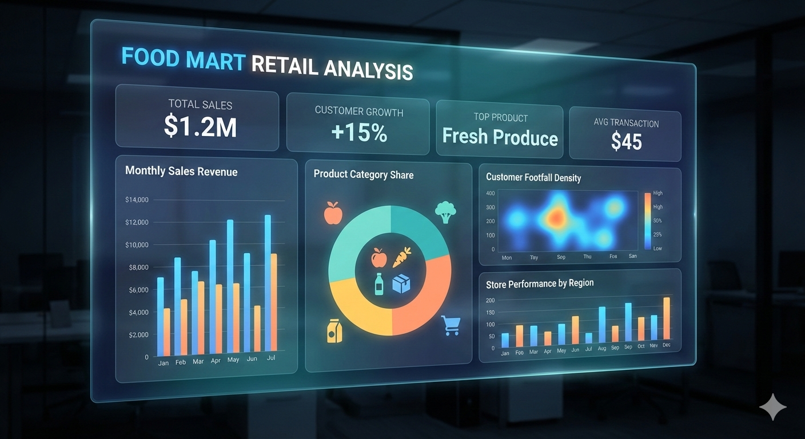
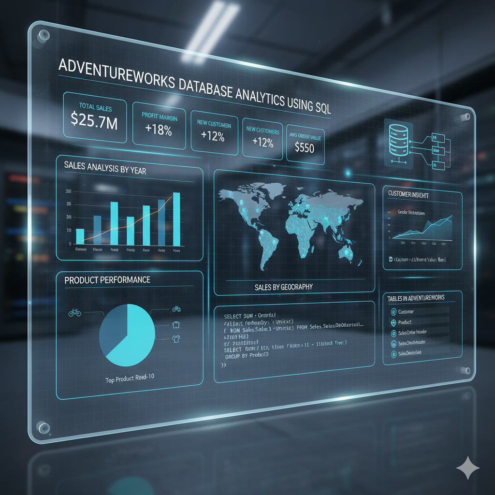
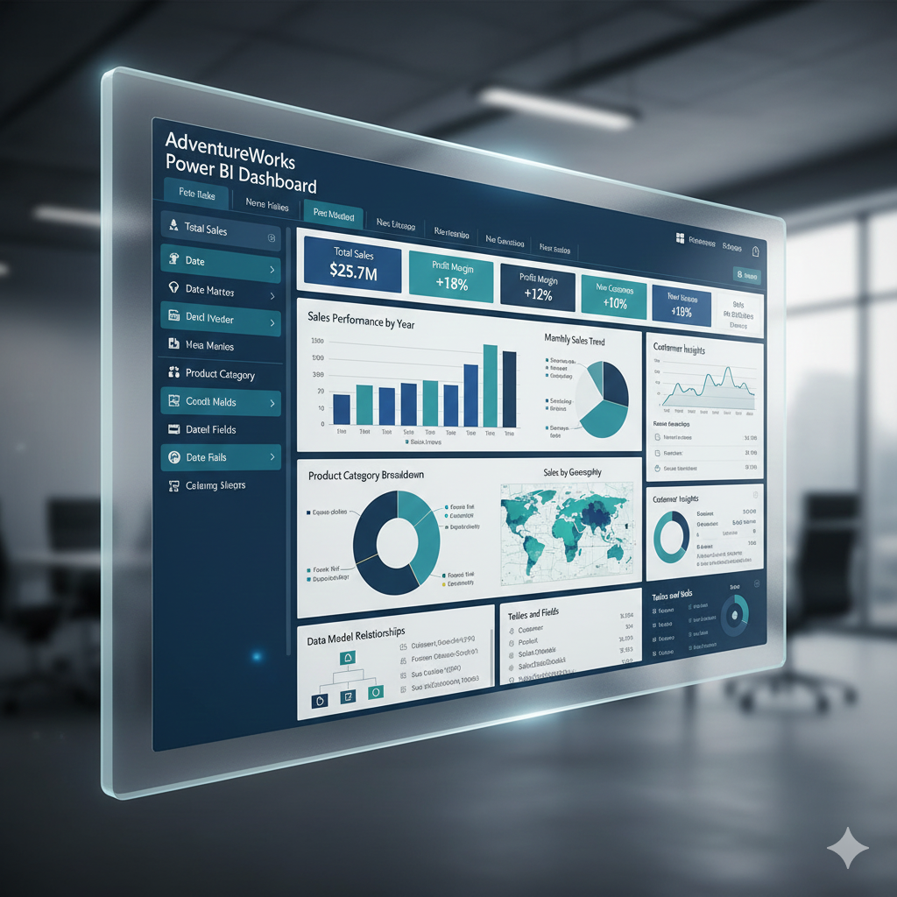

# STDS Portfolio: Ahmed Hussein Ali Abdelsalam Hussein

<p align="center">
  
</p>

<div align="center">

**A Collection of Data Analysis, Visualization, and Engineering Projects**

*by Ahmed Hussein Ali Abdelsalam Hussein*

[](https://www.microsoft.com/en-us/microsoft-365/excel)
[](https://powerbi.microsoft.com/)
[](https://www.tableau.com/)
[](https://www.microsoft.com/en-us/sql-server)
[](https://www.python.org/)
[](https://spark.apache.org/)
[](https://www.microsoft.com/en-us/microsoft-365)

</div>

---

## 📋 Table of Contents

- [Overview](#-overview)
- [Projects Summary](#-projects-summary)
- [Project Details](#-project-details)
  - [Project 1: Food Mart Retail Analysis](#1-food-mart-retail-analysis)
  - [Project 2: AdventureWorks Database Analytics](#2-adventureworks-database-analytics)
  - [Project 3: AdventureWorks Power BI Dashboard](#3-adventureworks-power-bi-dashboard)
  - [Project 4: Adidas Sales & Geographic Analysis](#4-adidas-sales--geographic-analysis)
  - [Project 5: GreenStream Energy ETL Pipeline](#5-greenstream-energy-etl-pipeline)
- [Technical Skills Matrix](#-technical-skills-matrix)
- [Getting Started](#-getting-started)
- [Contact](#-contact)

---

## 🎯 Overview

This portfolio showcases **5 comprehensive data analytics projects** demonstrating end-to-end capabilities in business intelligence, data visualization, database analysis, and data engineering. Each project addresses real-world business challenges through systematic data processing, insightful analysis, and actionable recommendations.

**Portfolio Highlights:**
- 📊 **$1B+** in total sales analyzed across retail and manufacturing sectors
- 🔍 **500K+** records processed with advanced SQL queries and data transformations
- 📈 **15+** interactive dashboards built with Excel and Power BI
- ⚙️ **Enterprise-grade ETL** pipeline architecture for smart meter data
- 🎯 **Business-focused insights** driving strategic decision-making

---

## 📊 Projects Summary

| # | Project Name | Period | Primary Tools | Key Metrics | Focus Area |
|---|-------------|--------|---------------|-------------|------------|
| **1** | 🛒 **Food Mart Retail Analysis** | 1997-1998 | Excel, Power Query, Power Pivot | $1.76M Sales, 59.73% Profit Margin | Retail BI & Excel Modeling |
| **2** | 💼 **AdventureWorks Database Analytics** | 2011-2014 | SQL Server, Excel | $123.22M Revenue, 275K Units | Database Analysis & SQL |
| **3** | 📊 **AdventureWorks Power BI Dashboard** | 2011-2014 | Power BI, DAX, SQL | $123.22M Revenue, 31K Orders | Interactive BI Dashboards |
| **4** | 👟 **Adidas Sales & Geographic Analysis** | 2020-2022 | Power BI, Geographic Mapping | $899.90M Sales, 9,648 Retailers | Sales Analytics & Mapping |
| **5** | ⚡ **GreenStream Energy ETL Pipeline** | Real-time | AWS/Cloud, Serverless Functions | 100K+ Meters, <4min Latency | Data Engineering & ETL |

---

## 🚀 Project Details

## 1. 🛒 Food Mart Retail Analysis

<p align="center">
  
</p>

### 📌 Project Overview
A comprehensive **Excel-powered business intelligence solution** analyzing retail sales performance across brands, customers, regions, and product categories. Built entirely with Microsoft Excel's advanced features including Power Query, Power Pivot, and interactive dashboards to deliver actionable insights for retail decision-making.

### 🎯 Business Problem
Food Mart needed to understand:
- Which brands and products drive the highest revenue?
- Who are the most valuable customers for retention strategies?
- How do sales vary by region, customer demographics, and family size?
- What factors contribute to the strong 59.73% profit margin?
- Which products have quality issues indicated by high return rates?

### 🧹 Data Processing
**Comprehensive data cleaning and modeling workflow:**
- ✅ Removed duplicate records to ensure data accuracy
- ✅ Dropped unnecessary columns to streamline analysis
- ✅ Created **Calendar Table** (1997-1998) for time intelligence
- ✅ Built **relational data model** linking Sales, Customers, Products, Stores, and Region tables
- ✅ Established relationships between fact and dimension tables
- ✅ Designed **Pivot Tables** as analytical foundation for all visualizations

### 💡 Key Insights

**📈 Financial Performance:**
- **Total Sales:** $1,764,495 with a strong **59.73% profit margin**
- **Returns:** 8,284 items flagged for potential quality review
- **Loyalty Program:** 10,281 active cardholders driving repeat business

**🏆 Top Performers:**
- **Leading Brand:** Hermanos ($57K) outperforms competitors
- **Top Customer:** Ida Rodriguez ($2.24K lifetime value)
- **Best Region:** North West dominates with $847.8K (48% of total sales)
- **Peak Sales Month:** December ($177.1K) - strong holiday performance

**👥 Customer Insights:**
- **Elite vs Normal:** 90.41% of revenue from regular customers (opportunity to grow elite segment)
- **Family Size Correlation:** Families with 2-3 children generate $370K+ per group
- **Income Bracket:** Customers earning <$100K/year represent core market segment
- **Gender Split:** Female customers contribute $532K profit vs. $520K male

**📍 Geographic & Demographic Patterns:**
- **Top City:** Richmond leads with 191 customers
- **Occupation:** Professional ($342K) and Skilled Manual ($283K) workers drive profit
- **Education:** Partial High School ($318K) and High School Degree ($311K) segments most profitable
- **Country Distribution:** USA (67%), Mexico (27%), Canada (6%)

**⚠️ Operational Concerns:**
- **High Return Products:** Hermanos Red Pepper (17 returns), Oranges (15 returns) - investigate quality issues
- **Store Performance:** Store 13 leads with $170.4K - analyze success factors for replication

### 🛠️ Technical Implementation
**Tools & Technologies:**
- **Microsoft Excel** (Advanced Features)
- **Power Query** for data extraction and transformation
- **Power Pivot** for relational data modeling
- **Pivot Tables & Charts** for aggregation and visualization
- **Slicers & Filters** for interactive analysis
- **Calendar Table** for date-based intelligence

**Architecture:**
```
Raw Data → Power Query Cleaning → Power Pivot Modeling → Pivot Tables → Interactive Dashboard
```

### 📊 Business Impact
- ✅ Identified **North West region** for continued investment (48% of sales)
- ✅ Highlighted **family-focused marketing** opportunities (2-3 children segment)
- ✅ Revealed **product quality issues** requiring immediate attention
- ✅ Provided **customer retention** targets (elite segment growth opportunity)
- ✅ Demonstrated **Excel as enterprise BI tool** for cost-effective analytics

---

## 2. 💼 AdventureWorks Database Analytics
<p align="center">
  
</p>

### 📌 Project Overview
An **SQL-driven database analysis project** featuring three comprehensive Excel dashboards that transform AdventureWorks transactional data into strategic business intelligence. Combines advanced SQL preprocessing with Excel visualization to analyze $123.22M in revenue across multiple years, territories, and product lines.

### 🎯 Business Problem
AdventureWorks management needed answers to:
- What are the sales trends across different time periods and territories?
- Which products and categories drive the highest revenue and profit?
- How do shipping methods impact freight costs and delivery efficiency?
- Which sales representatives generate the most revenue, and are there performance disparities?
- Are there data quality issues affecting decision-making accuracy?

### 🔧 Data Processing
**Multi-stage SQL and Excel preprocessing:**

**SQL Data Preparation:**
- ✅ **Removed NULL columns** with excessive missing values
- ✅ **Updated critical values** using INSERT queries for data completeness
- ✅ **Merged multiple tables** into unified views via SQL JOINs
- ✅ **Created Calendar Table** using Power Query Advanced Editor (M language)
- ✅ **Established date hierarchies** (Year → Quarter → Month → Day)

**Excel Modeling:**
- ✅ Built relationships between Sales, Products, Territories, and Employees tables
- ✅ Created Pivot Tables with calculated fields
- ✅ Designed interactive slicers for Year and Quarter filtering

### 💡 Key Insights

**📈 Financial Overview:**
- **Total Revenue:** $123.22M across 2011-2014
- **Sub Total:** $109.85M (89.1% of total)
- **Tax Amount:** $10.19M (8.3% effective rate)
- **Freight Costs:** $3.18M (2.6% of revenue)
- **Total Units Sold:** 275,000

**🌍 Geographic Performance:**
- **North America:** $89.23M (72.4%) - dominant market
- **Europe:** $22.17M (18.0%) - growing opportunity
- **Pacific:** $11.81M (9.6%) - emerging market
- **⚠️ Data Quality Alert:** Southwest territory shows $127.15M (exceeds total KPI) - indicates aggregation error requiring investigation

**📦 Product Analysis:**
- **Category Concentration:** Bikes represent **86% of total sales** ($106.09M)
  - Road Bikes: $49.15M (39.9%)
  - Mountain Bikes: $40.88M (33.2%)
  - Touring Bikes: $16.07M (13.0%)
- **Top Product:** Mountain-200 Black, 38 ($4.93M)
- **Top 6 Mountain-200 variants:** $24.94M combined (20% of revenue) - **high product concentration risk**

**🚚 Logistics Insights:**
- **XRQ Truck Ground:** $2.45M (77.0%) - cost-effective preference
- **Cargo Transport 5:** $0.73M (23.0%)
- **Recommendation:** Analyze delivery speed vs. customer satisfaction trade-offs

**👥 Sales Team Performance:**
- **🌟 Star Performer:** José Saraiva - $39.12M (31.7% of total company sales)
  - **334% higher** than second-place performer
  - **Critical business risk:** Heavy dependence on single representative
- **Top 8 Team Total:** $102.67M
- **Performance Gap:** $27.42M between #1 and #2 performer

**📊 Time Series Analysis:**
- **Peak Month:** March ($15.26M)
- **Lowest Month:** February ($5.73M)
- **Volatility:** 166% variation between peak and trough
- **⚠️ Chart Issue:** X-axis not chronological - limits seasonal trend analysis

### 🛠️ Technical Implementation
**Tools & Technologies:**
- **Microsoft SQL Server** for data extraction and transformation
- **Microsoft Excel** for visualization and dashboard creation
- **SQL Queries** for data cleaning, merging, and aggregation
- **Power Query M Language** for Calendar Table generation
- **Pivot Tables** with calculated fields and measures

**SQL Processing Examples:**
```sql
-- Removed NULL columns
-- Updated missing values with INSERT statements
-- Created unified views with JOINs across Sales, Products, Territories
-- Built Calendar dimension for time intelligence
```

### 📊 Business Impact
- ⚠️ **Risk Mitigation:** Identified dangerous dependence on single sales rep (José Saraiva)
- ✅ **Knowledge Transfer Recommendation:** Document José's methodology for team training
- ✅ **Geographic Strategy:** Focus on North America (72% of revenue) while growing Europe
- ✅ **Product Diversification:** Reduce concentration risk beyond Mountain-200 series
- ✅ **Data Quality Alert:** Flagged territorial aggregation error for IT review
- ✅ **Logistics Optimization:** Evaluate speed vs. cost balance in shipping methods

---

## 3. 📊 AdventureWorks Power BI Dashboard

<p align="center">
  
</p>

### 📌 Project Overview
A **highly interactive Power BI business intelligence solution** featuring advanced visualizations, DAX measures, and key influencers analysis. Transforms the same AdventureWorks dataset into a dynamic, drill-through dashboard experience with real-time filtering, cross-visual interactions, and predictive insights.

### 🎯 Business Problem
Building on the SQL/Excel analysis, AdventureWorks needed:
- **Real-time interactive exploration** of sales data across multiple dimensions
- **Advanced analytics** including key influencers and trend decomposition
- **User-friendly interface** for non-technical stakeholders
- **Cross-filtering capabilities** to explore relationships between metrics
- **Predictive insights** to identify factors driving business outcomes

### 🔄 Data Processing
**Power BI Data Pipeline:**
- ✅ Connected to SQL Server database or imported cleaned Excel files
- ✅ Built **data model** with relationships between dimension and fact tables
- ✅ Created **DAX measures** for calculated metrics (YoY growth, running totals)
- ✅ Designed **Calendar Table** for time intelligence functions
- ✅ Optimized data types and removed unnecessary columns for performance
- ✅ Implemented **row-level security** (if applicable for multi-user scenarios)

### 💡 Key Insights

**📈 Core KPIs (Consistent Across Dashboards):**
- **Total Due:** $123.22M
- **Subtotal:** $109.85M
- **Tax Amount:** $10.19M
- **Total Freight:** $3.18M
- **Total Quantity:** 275K units
- **Total Orders:** 31K

**🎯 Advanced Analytics Features:**

**Dashboard 1: Sales Overview**
- **Category Performance:** Bikes ($106M), Components, Clothing, Accessories
- **Shipping Method Distribution:** Online (50.7%), Outlet (31.3%), In-store (18.0%)
- **Temporal Trends:** Monthly subtotal and total due tracking
- **Regional Comparison:** North America, Europe, Pacific bubble maps

**Dashboard 2: Product & Customer Intelligence**
- **Top Products Ranking:** Interactive bar charts with drill-through capability
- **Key Influencers Analysis:** AI-powered insights identifying factors driving high sales
- **Customer Performance:** Individual customer revenue contribution tracking
- **Correlation Analysis:** Sales vs. profit scatter plots

**Dashboard 3: Geographic & Channel Analysis**
- **Interactive Maps:** Geographic heatmaps showing sales density by region
- **Sales Channel Mix:** Pie charts with percentage breakdowns
- **Time Series:** Trend lines with forecasting capabilities
- **Cross-filtering:** Click any chart to filter all related visuals

### 🛠️ Technical Implementation

**Power BI Features Utilized:**
- **Data Modeling:** Star schema with fact and dimension tables
- **DAX Measures:**
  ```dax
  Total Revenue = SUM(Sales[TotalDue])
  YoY Growth = DIVIDE([Current Year Sales] - [Previous Year Sales], [Previous Year Sales])
  Running Total = CALCULATE([Total Revenue], FILTER(ALL('Calendar'), 'Calendar'[Date] <= MAX('Calendar'[Date])))
  ```
- **Visualizations:**
  - KPI cards with conditional formatting
  - Clustered bar/column charts
  - Geographic bubble maps
  - Pie/donut charts
  - Line charts with forecasting
  - Scatter plots
  - Key influencers AI visual
  - Decomposition tree
- **Interactivity:**
  - Cross-filtering and cross-highlighting
  - Drill-through pages
  - Tooltips with custom formatting
  - Bookmarks for navigation
  - Slicers for Year, Quarter, Region, Product

**Performance Optimization:**
- ✅ Aggregations for large datasets
- ✅ DirectQuery vs. Import mode evaluation
- ✅ Reduced cardinality in dimension tables
- ✅ Efficient DAX queries avoiding row-by-row calculations

### 📊 Business Impact
- ✅ **Self-Service Analytics:** Empowered non-technical users to explore data independently
- ✅ **Faster Insights:** Reduced analysis time from hours (Excel) to minutes (Power BI)
- ✅ **Predictive Intelligence:** Key influencers revealed hidden drivers of sales performance
- ✅ **Real-Time Decision Making:** Interactive filters enable ad-hoc analysis during meetings
- ✅ **Scalability:** Dashboard easily refreshes with new data without rebuilding
- ✅ **Mobile Access:** Responsive design allows insights on phones/tablets

**Technical Achievement:**
> Successfully transformed static Excel dashboards into dynamic, AI-enhanced Power BI solution, demonstrating proficiency in both tools and understanding when each is most appropriate.

---

## 4. 👟 Adidas Sales & Geographic Analysis

### 📌 Project Overview
A **geographically-focused Power BI analytics solution** analyzing **$899.90M in Adidas sales** across the United States from 2020-2022. Features advanced geographic visualizations, multi-dimensional sales channel analysis, and retailer performance tracking across 9,648 retail locations, demonstrating expertise in spatial analytics and business intelligence.

### 🎯 Business Problem
Adidas needed to understand:
- Which US states and cities generate the highest revenue and profit?
- How do different sales channels (Online, Outlet, In-store) perform?
- Which retail partners drive the most revenue, and how does performance vary by region?
- What product categories (Men's/Women's × Apparel/Footwear) perform best in each region?
- How did sales trends evolve during and after the COVID-19 pandemic (2020-2022)?

### 🔄 Data Processing
**Power BI Geographic Data Pipeline:**
- ✅ **Geocoding:** Mapped city/state data to latitude/longitude coordinates
- ✅ **Data Modeling:** Created relationships between Sales, Products, Retailers, and Geography tables
- ✅ **DAX Calculations:** Built measures for regional aggregations, YoY growth, and profitability
- ✅ **Time Intelligence:** Implemented calendar table for trend analysis (2020-2022)
- ✅ **Hierarchy Design:** Created drill-down paths (Country → State → City)
- ✅ **Performance Optimization:** Aggregated sales by geography to improve map rendering speed

### 💡 Key Insights

**💰 Financial Overview (2020-2022):**
- **Total Sales:** $899.90M
- **Total Profit:** $332.13M (36.9% profit margin)
- **Units Sold:** 2.48M
- **Retail Locations:** 9,648 nationwide
- **Average Price Per Unit:** $48.48

**🗺️ Geographic Performance:**

**Top States:**
- 🥇 **New York:** $64.23M (metro areas driving concentration)
- 🥈 **California:** $21.00M (West Coast strength)
- 🥉 **Texas:** $20.86M (Southern market penetration)
- **Florida:** $18.65M (growing southeastern presence)

**Top Cities:**
- Major metropolitan areas: $14.8M in top city clusters
- New York City: $5.68M
- New Orleans: $3.38M
- Albuquerque: $2.82M
- **Data Opportunity:** 38 locations with unknown city data - geocoding improvement needed

**🌎 Regional Analysis:**

| Region | Sales | % of Total | Key Insight |
|--------|-------|------------|-------------|
| **West** | $269.94M | 33.6% | 🏆 Dominant region - highest across all product categories |
| **Northeast** | $186.32M | 23.2% | Strong urban market concentration |
| **Southeast** | $163.17M | 20.3% | Growing market with expansion potential |
| **South** | $144.66M | 18.0% | Opportunity region for targeted growth |
| **Midwest** | - | - | Lower penetration - strategic gap |

**📦 Product Category Performance by Region:**

| Product Category | Midwest | Northeast | South | Southeast | West | **Best Region** |
|-----------------|---------|-----------|-------|-----------|------|-----------------|
| Men's Street Footwear | $4.71M | $6.84M | $4.05M | $4.69M | **$7.39M** | West |
| Men's Athletic Footwear | $2.62M | $3.90M | $3.65M | $3.65M | **$6.76M** | West |
| Men's Apparel | $2.22M | $3.48M | $2.81M | $3.18M | **$4.83M** | West |
| Women's Apparel | $3.45M | $5.05M | $4.22M | $4.11M | **$7.04M** | West |
| Women's Athletic Footwear | $1.67M | $2.67M | $2.63M | $2.67M | **$4.67M** | West |
| Women's Street Footwear | $2.00M | $3.15M | $3.24M | $3.06M | **$5.75M** | West |

**Key Finding:** West region dominates across **all product categories**, indicating strong brand presence and market fit.

**🏬 Retailer Performance:**

**Top Partners by Revenue:**
1. **West Gear:** $32.41M - Market leader
2. **Foot Locker:** $29.02M - Strong athletic footwear focus
3. **Sports Direct:** $24.62M - Balanced portfolio
4. **Kohl's:** $13.51M - Mid-tier department store channel
5. **Walmart:** $10.51M - Mass-market penetration
6. **Amazon:** $10.10M - Growing online presence

**Retailer Performance by Product Category:**
- **Foot Locker:** Peaks at ~$20M in Men's categories - athletic specialization
- **West Gear:** Consistent high performance across all segments
- **Sports Direct:** Balanced Men's/Women's mix - diversified strategy

**🛒 Sales Channel Distribution:**
- **Online:** 50.7% - Digital-first customer preference
- **Outlet:** 31.3% - Strong discount channel performance
- **In-store:** 18.0% - Traditional retail declining but still relevant

**Insight:** Over half of sales are online, indicating successful digital transformation and need for continued e-commerce investment.

**📈 Temporal Trends (2020-2022):**
- **2020:** Relatively flat performance (COVID-19 impact)
- **Early 2021:** Significant dip (pandemic uncertainty)
- **Mid-2021 onwards:** Sharp recovery and growth acceleration
- **Late 2022:** Peak revenue (~$10M+ monthly) with sustained high performance
- **Volatility:** Some fluctuation in late 2022 - potential supply chain or seasonal factors

### 🛠️ Technical Implementation

**Power BI Geographic Features:**
- **Filled Maps:** State-level choropleth maps showing sales intensity
- **Bubble Maps:** City-level visualizations with size proportional to revenue
- **Scatter Plots:** Sales vs. Profit correlation analysis
- **Data Tables:** Regional product breakdown with drill-through
- **Time Series Line Charts:** Monthly revenue tracking with trend lines
- **Pie/Donut Charts:** Sales channel and regional distribution
- **Stacked Bar Charts:** Multi-dimensional retailer performance by gender categories

**DAX Measures:**
```dax
Total Revenue = SUM(Sales[Revenue])
Profit Margin = DIVIDE([Total Profit], [Total Sales], 0)
YoY Growth = DIVIDE([Current Year Sales] - [Previous Year Sales], [Previous Year Sales])
Average Price Per Unit = DIVIDE([Total Sales], [Units Sold])
Regional Share = DIVIDE([Region Sales], [Total Sales])
```

**Interactive Filters:**
- Region (West, Northeast, Southeast, South, Midwest)
- State (50 states + DC)
- City (Major metropolitan areas)
- Sales Method (Online, Outlet, In-store)
- Retailer (Amazon, Foot Locker, Kohl's, Sports Direct, Walmart, West Gear)
- Product Category (6 categories: Men's/Women's × Apparel/Athletic/Street Footwear)

### 📊 Business Impact

**Strategic Recommendations:**

✅ **Digital Transformation Success:** 50.7% online sales validates e-commerce strategy - continue digital investment

✅ **West Region Dominance:** $269.94M (33.6%) - maintain market leadership through:
- Targeted marketing campaigns
- Premium product launches in West Coast markets
- Partnership strengthening with West Gear ($32.41M top retailer)

✅ **Growth Opportunities:**
- **South Region:** $144.66M (18.0%) - lowest share, highest growth potential
- **Midwest:** Underpenetrated - strategic expansion opportunity
- **Retailer Diversification:** Reduce dependence on top 3 partners (represent 53% of partner sales)

✅ **Product Strategy:**
- **Men's Street Footwear:** #1 category - prioritize inventory and marketing
- **Women's Apparel:** Highest women's category ($24.87M total) - expand offerings
- **Athletic Footwear:** Strong in West - leverage for 2024 Olympics marketing

✅ **Data Quality Enhancement:**
- Fix 38 locations with unknown city data
- Improve geocoding accuracy for better spatial analysis

✅ **Pricing Strategy:**
- Average unit price: $48.48 (mid-range positioning)
- Consider premium line expansion in high-performing West region
- Evaluate outlet pricing strategy (31.3% of sales)

✅ **COVID-19 Recovery Analysis:**
- Sales accelerated significantly from mid-2021
- Replicate successful recovery strategies in future disruptions
- Maintain flexible omnichannel approach (online + outlet strength)

**Technical Achievement:**
> Demonstrated advanced **geographic analytics** and **spatial intelligence** capabilities, transforming location data into actionable regional strategies while maintaining clear, interactive visualizations for executive decision-making.

---

## 5. ⚡ GreenStream Energy ETL Pipeline

### 📌 Project Overview
An **enterprise-grade serverless ETL architecture** designed for real-time smart meter data processing in the energy sector. Handles **100,000+ smart meters** with sub-4-minute latency, processing consumption data from ingestion through validation, transformation, and analytics-ready storage. Demonstrates advanced data engineering, cloud architecture, and operational resilience design.

### 🎯 Business Problem
GreenStream Energy faced critical data infrastructure challenges:
- How to process **real-time meter readings** from 100K+ devices with minimal latency?
- How to ensure **data quality and trustworthiness** for billing and analytics?
- How to **detect faulty meters** automatically before they impact customer experience?
- How to identify **peak demand periods** for grid load optimization and time-of-use pricing?
- How to build a **resilient, scalable, cost-effective** pipeline with zero data loss?
- How to balance **real-time needs** (dashboards) with **long-term storage** (regulatory compliance)?

### ⚙️ Data Processing

**End-to-End Pipeline Architecture:**

```
Smart Meters (100K+)
    ↓
📡 SFTP/API Gateway Ingestion
    ↓
📦 Raw Storage Layer (S3/GCS/Azure Blob)
    ↓ (Success Path)
🔄 Orchestration Layer (Step Functions/Cloud Composer)
    ↓
⚙️ Serverless Transformation (Lambda/Cloud Functions)
    ├─► ✅ Validated Data → PostgreSQL RDS (Real-time access <50ms)
    ├─► ⚠️ Error Queue → Auto-Retry (3x) → Alerts
    └─► ⏸️ Quarantine → Manual Review (Quality <70)
    ↓
📊 Analytics Storage (Parquet - 70% cost reduction)
    ↓
🎯 Business Applications:
    • Real-time dashboards
    • Billing calculations
    • ML demand forecasting
    • Regulatory reporting
```

**Business Transformation Rules:**

**1️⃣ Unit Standardization ⚡**
- **Logic:** Convert all readings to kilowatts (kW)
  - Watts → kW: value / 1000
  - Missing units: Infer based on magnitude (<10 = kW, >1000 = W)
- **Quality Impact:** -5 points for conversion applied

**2️⃣ Missing Value Handling 🔍**
- **Gap <4 hours:** Linear interpolation (-10 points/hour)
- **Gap 4-24 hours:** Flag as `missing_short`, exclude from peak analysis
- **Gap ≥24 hours:** Flag as `missing_extended`, trigger critical alert to Data Ops

**3️⃣ Data Validation ✓**
- **Meter Registry Check:** Cross-reference against master list (reject unknowns)
- **Timestamp Sanity:** Must be ±1 hour of server time
- **Physical Limits:** 0-20 kW residential range (out-of-range → quarantine)
- **Rate-of-Change Detection:** Flag >500% spikes or >90% drops
- **Quality Impact:** -15 points per validation warning

**4️⃣ Faulty Meter Detection ⚠️**
Automated pattern recognition:
- **Zero Value Fault:** 0 kW for ≥48 hours (excluding whitelisted vacant properties)
- **Stuck Value Fault:** No variance for ≥24 hours (σ² = 0) → auto-ticket field service
- **Overload Fault:** >20 kW for ≥6 consecutive readings → critical alert
- **Low Variance Fault:** 7-day coefficient of variation <0.01 → calibration needed
- **Neighborhood Correlation Fault:** Correlation <0.3 with nearby meters → statistical review

**5️⃣ Peak Period Identification 📊**
- Aggregate hourly consumption across all meters
- Identify top 3 hours/day
- Apply seasonal adjustments (AC in summer, heating in winter)
- Exclude outliers (holidays, extreme weather, maintenance)
- **Output:** Powers time-of-use pricing and demand response programs

**6️⃣ Quality Scoring System ⭐**
```
Base Score: 100 points
Deductions:
  - Unit conversion:       -5
  - Interpolation/hour:    -10
  - Validation warnings:   -15 each
  - Rate-of-change flags:  -20
  - Fault detection:       -30

Thresholds:
  ≥90: Premium (ML training)
  70-89: Standard (analytics approved)
  <70: Quarantine (excluded from production)
```

### 💡 Key Technical Insights

**⏱️ Performance Metrics:**
- **Real-time Latency:** <4 minutes (meter → dashboard)
- **Analytics Latency:** ~65 minutes (meter → Parquet archive)
- **Data Loss Rate:** 0% (dead letter queue ensures no loss)
- **Transformation Success:** 99.7%
- **Auto-Recovery Rate:** 92% (3-retry strategy)
- **Storage Cost Reduction:** 70% (Parquet compression vs. raw CSV)

**🛡️ Resilience Features:**

| Error Type | Handling Strategy | SLA |
|------------|-------------------|-----|
| Ingestion Failure | Dead Letter Queue → Manual Review | 24h resolution |
| Transformation Failure | Auto-Retry 3x (exponential backoff) → Alert + JIRA ticket | <30min response |
| Validation Warning | Quarantine Storage → Daily batch review | <4h review |
| Quality Score <70 | Exclude from production, manual override possible | Next business day |
| Missing Data (Extended ≥24h) | 🔴 Critical Alert | <15min response |
| Meter Fault Detected | 🟡 Warning + Field Service Ticket | <1h notification |

**🔄 Data Journey Example:**
```
Meter #MTR-78910 records 1250W at 14:00:00

t+0min:   📡 HTTPS transmission
t+1min:   📥 Raw ingestion to S3 (schema validated)
t+2min:   🎬 Workflow trigger (Lambda invoked)
t+3min:   ⚙️ Transformation:
            • 1250W → 1.25kW
            • Physical limits: ✓ PASS
            • Meter registry: ✓ PASS
            • Quality Score: 95/100
t+4min:   💾 PostgreSQL insert (available for dashboards)
t+60min:  📊 Hourly aggregation (AVG, MIN, MAX, STDDEV)
t+65min:  🗄️ Parquet archival (70% compressed, analytics-ready)

End State: Real-time dashboard + Long-term ML training dataset
```

### 🛠️ Technical Implementation

**Technology Stack:**

**Storage Layer:**
- **Raw:** Amazon S3 / Google Cloud Storage (timestamped partitions: `raw/YYYY/MM/DD/HH/`)
- **Structured:** PostgreSQL RDS / Cloud SQL (<50ms query latency)
- **Analytics:** Parquet on S3 / BigQuery (columnar format, 10x faster queries)

**Compute Layer:**
- **Transformation:** AWS Lambda / Google Cloud Functions (auto-scaling serverless)
- **Orchestration:** AWS Step Functions / Cloud Composer (DAG workflow management)
- **Batch Processing:** AWS Batch / Dataflow (hourly aggregations)

**Monitoring & Observability:**
- **Logging:** CloudWatch / Stackdriver (centralized log aggregation)
- **Alerts:** SNS / PubSub (multi-channel: email, Slack, PagerDuty)
- **Metrics:** CloudWatch Metrics / Cloud Monitoring (dashboard visualization)

**Security & Compliance:**
- **Encryption:** AES-256 at-rest, TLS 1.3 in-transit
- **Access Control:** IAM roles with least privilege principle
- **Audit Trail:** CloudTrail / Audit Logs (7-year retention for regulatory compliance)

**Data Governance:**
- **Raw Data Retention:** 90 days hot → 7 years cold storage
- **Validated Data:** 2 years active database
- **Analytics Data:** Indefinite compressed archival
- **Error Logs:** 1 year
- **Audit Trails:** 7 years (regulatory requirement)

### 📊 Business Impact

**Operational Excellence:**
- ✅ **Zero Data Loss:** Dead letter queue and quarantine system ensure no readings are permanently lost
- ✅ **Proactive Fault Detection:** Automated identification of faulty meters **before** customer complaints
- ✅ **Quality Assurance:** Only data scoring ≥70 used in production analytics, ensuring trustworthy insights
- ✅ **Cost Optimization:** 70% storage cost reduction through intelligent Parquet compression
- ✅ **Scalability:** Serverless architecture handles 10x traffic spikes without manual intervention

**Business Value:**
- 💰 **Billing Accuracy:** High-quality data ensures correct customer charges, reducing disputes
- 📈 **Demand Forecasting:** ML models trained on score ≥90 data enable accurate grid load predictions
- ⚡ **Peak Optimization:** Time-of-use pricing based on actual peak periods reduces grid strain
- 🔧 **Preventive Maintenance:** Faulty meter detection reduces truck rolls and emergency repairs
- 📊 **Real-Time Intelligence:** <4-minute latency enables live monitoring and rapid response

**Technical Achievement:**
> Designed and documented an **enterprise-grade, cloud-native ETL architecture** demonstrating deep understanding of:
> - Serverless computing and auto-scaling
> - Data quality management and governance
> - Real-time vs. batch processing trade-offs
> - Cost optimization through intelligent storage design
> - Operational resilience and error handling patterns
> - Regulatory compliance and audit requirements

---

## 🎓 Technical Skills Matrix

### 📊 Data Visualization
| Skill | Proficiency | Projects Applied | Key Capabilities |
|-------|-------------|------------------|------------------|
| **Microsoft Excel** | ⭐⭐⭐⭐⭐ Expert | Food Mart, AdventureWorks DB | Pivot Tables, Power Query, Power Pivot, Interactive Dashboards |
| **Power BI** | ⭐⭐⭐⭐⭐ Expert | AdventureWorks BI, Adidas | DAX, Data Modeling, Geographic Maps, Key Influencers |
| **Tableau** | ⭐⭐⭐⭐ Advanced | Adidas (mentioned as alternative) | Interactive Visualizations, Calculated Fields |

### 🔍 Data Analysis
| Skill | Proficiency | Projects Applied | Key Capabilities |
|-------|-------------|------------------|------------------|
| **SQL** | ⭐⭐⭐⭐⭐ Expert | AdventureWorks DB | Complex Joins, Views, Data Cleaning, INSERT/UPDATE |
| **DAX (Power BI)** | ⭐⭐⭐⭐ Advanced | AdventureWorks BI, Adidas | Time Intelligence, Calculated Measures, YoY Growth |
| **Statistical Analysis** | ⭐⭐⭐⭐ Advanced | All Projects | Trend Analysis, Correlation, Variance Detection |

### ⚙️ Data Engineering
| Skill | Proficiency | Projects Applied | Key Capabilities |
|-------|-------------|------------------|------------------|
| **ETL Architecture** | ⭐⭐⭐⭐⭐ Expert | GreenStream Energy | Serverless Pipelines, Orchestration, Error Handling |
| **Cloud Platforms** | ⭐⭐⭐⭐ Advanced | GreenStream Energy | AWS (Lambda, S3, RDS), GCP, Azure |
| **Data Quality** | ⭐⭐⭐⭐⭐ Expert | GreenStream Energy | Validation Rules, Quality Scoring, Fault Detection |
| **Python** | ⭐⭐⭐⭐ Advanced | Adidas (mentioned) | Pandas, NumPy, Data Transformation |

### 📈 Business Intelligence
| Skill | Proficiency | Projects Applied | Key Capabilities |
|-------|-------------|------------------|------------------|
| **KPI Design** | ⭐⭐⭐⭐⭐ Expert | All Projects | Financial Metrics, Performance Indicators, Scorecards |
| **Dashboard Design** | ⭐⭐⭐⭐⭐ Expert | All Projects | User Experience, Interactivity, Visual Hierarchy |
| **Data Modeling** | ⭐⭐⭐⭐⭐ Expert | Food Mart, AdventureWorks | Star Schema, Relationships, Hierarchies |
| **Business Analysis** | ⭐⭐⭐⭐⭐ Expert | All Projects | Insight Generation, Strategic Recommendations |

### 🛠️ Tools & Technologies
```
📊 Visualization:     Excel, Power BI, Tableau
💾 Databases:         SQL Server, PostgreSQL, MySQL
☁️ Cloud:             AWS (Lambda, S3, RDS, Step Functions), GCP, Azure
🔧 ETL:               Power Query, SQL, Serverless Functions
📈 Analytics:         DAX, M Language, Python (Pandas, NumPy)
🗺️ Geographic:        Power BI Maps, Mapbox, Geocoding APIs
🔄 Orchestration:     AWS Step Functions, Cloud Composer
📝 Documentation:     Markdown, Technical Writing
```

---

## 🚀 Getting Started

### 📂 Repository Structure
```
STDS-Portfolio/
│
├── 📁 01-Food-Mart-Retail/
│   ├── FoodMart_Dashboard.xlsx
│   ├── README.md
│   └── data/ (if applicable)
│
├── 📁 02-AdventureWorks-SQL/
│   ├── AdventureWorks_Dashboards.xlsx
│   ├── SQL_Scripts/
│   │   ├── data_cleaning.sql
│   │   ├── create_views.sql
│   │   └── calendar_table.sql
│   └── README.md
│
├── 📁 03-AdventureWorks-PowerBI/
│   ├── AdventureWorks_Dashboard.pbix
│   ├── Screenshots/
│   └── README.md
│
├── 📁 04-Adidas-Sales-Analysis/
│   ├── Adidas_Analysis.pbix
│   ├── Screenshots/
│   └── README.md
│
├── 📁 05-GreenStream-ETL/
│   ├── Architecture_Diagram.png
│   ├── ETL_Documentation.md
│   └── README.md
│
└── README.md (this file)
```

### 💻 How to View Projects

#### 📊 **Excel Dashboards** (Food Mart, AdventureWorks SQL)
**Prerequisites:**
- Microsoft Excel 2016 or later
- Recommended: Excel 365 for best compatibility

**Steps:**
1. Download the `.xlsx` file from the respective project folder
2. Open with Microsoft Excel
3. **Enable Content** if prompted (required for Pivot Tables and Power Query)
4. Use slicers and filters to interact with the dashboard
5. Navigate between sheets to explore different analytical views

**Note:** Some features (Power Query, Power Pivot) may require Excel Professional Plus or Excel 365.

---

#### 📈 **Power BI Dashboards** (AdventureWorks BI, Adidas)
**Prerequisites:**
- **Power BI Desktop** (Free download: [https://powerbi.microsoft.com/desktop/](https://powerbi.microsoft.com/desktop/))
- Windows 10/11 or macOS with Power BI
- Minimum 4GB RAM (8GB recommended)

**Steps:**
1. Install Power BI Desktop from Microsoft
2. Download the `.pbix` file from the project folder
3. Open the file with Power BI Desktop
4. **Refresh data** (if connected to live database):
   - Go to `Home → Refresh`
   - Update connection strings if necessary
5. **Navigate dashboards:**
   - Use tabs at the bottom to switch between pages
   - Click on any visual to cross-filter related charts
   - Use slicers (Year, Quarter, Region, etc.) for custom analysis
6. **Export data:**
   - Right-click any visual → `Export data` to Excel

**Troubleshooting:**
- If data source errors appear, the file may be using Import mode with pre-loaded data (no refresh needed)
- Geographic maps require internet connection for rendering

---

#### ⚡ **ETL Pipeline** (GreenStream Energy)
**Documentation-Only Project:**
- This is an **architectural design project** showcasing data engineering expertise
- No executable code provided (conceptual enterprise architecture)
- Review the comprehensive documentation:
  - `Architecture_Diagram.png` - Visual pipeline flow
  - `ETL_Documentation.md` - Detailed technical specifications
  - `README.md` - Business context and transformation rules

**For Implementation:**
- Architecture is cloud-agnostic (adaptable to AWS, GCP, or Azure)
- Requires cloud account and infrastructure setup for actual deployment
- Contact for consulting on implementation

---

### 📊 Data Sources
**Note on Data Availability:**
- **AdventureWorks:** Microsoft sample database (publicly available)
  - Download: [AdventureWorks Sample Databases](https://learn.microsoft.com/en-us/sql/samples/adventureworks-install-configure)
- **Food Mart:** Retail industry sample dataset
- **Adidas Sales:** Synthetic/sample data for educational purposes
- **GreenStream:** Conceptual smart meter architecture (no real data)

**Data is pre-processed** in all dashboard files for immediate viewing. No external database connection required unless you want to refresh with new data.

---

## 📧 Contact

### 👤 Ahmed Hussein Ali Abdelsalam Hussein

**Connect with me for:**
- Data Analytics & Business Intelligence projects
- Power BI & Excel dashboard development
- SQL database analysis and optimization
- ETL pipeline design and data engineering consulting
- Collaboration opportunities

**📬 Email:** [ahmedhussein12215@gmail.com](mailto:ahmedhussein12215@gmail.com)

**💻 GitHub:** [@A7med668](https://github.com/A7med668)

**📂 Portfolio Repository:** [github.com/A7med668/STDS-Portfolio](https://github.com/A7med668/STDS-Portfolio) *(update with actual link)*

---

## 🙏 Acknowledgments

- **Microsoft AdventureWorks Team** - For providing comprehensive sample database
- **Power BI Community** - For visualization best practices and DAX techniques
- **Data Analytics Mentors** - For guidance on business intelligence methodologies
- **Open Source Contributors** - For tools and libraries that made this analysis possible

---

## 📄 License

This portfolio is provided for **educational and demonstration purposes**. Individual projects may have different usage terms:
- **Dashboards & Code:** Available for review and learning
- **Data:** Publicly available sample datasets or synthetic data
- **Architecture Designs:** Conceptual frameworks for discussion

For commercial use or collaboration inquiries, please contact via email.

---

## 🔄 Project Timeline

```
📅 Portfolio Development Timeline:

├─ 2023 Q1-Q2: Food Mart Retail Analysis (Excel Deep Dive)
├─ 2023 Q3: AdventureWorks SQL Database Analysis
├─ 2023 Q4: AdventureWorks Power BI Dashboard (BI Transition)
├─ 2024 Q1: Adidas Geographic Sales Analysis (Advanced Mapping)
└─ 2024 Q2: GreenStream ETL Architecture (Data Engineering)
```

---

<div align="center">

### 🌟 Thank you for reviewing my portfolio! 🌟

**If you find these projects valuable, please consider:**
- ⭐ Starring this repository
- 🔗 Connecting on LinkedIn *(add link if applicable)*
- 💬 Providing feedback or collaboration opportunities

---

**Built with:** Microsoft Excel • Power BI • SQL Server • Cloud Architecture • Passion for Data 📊

*Last Updated: 2024 Q2*

</div>
